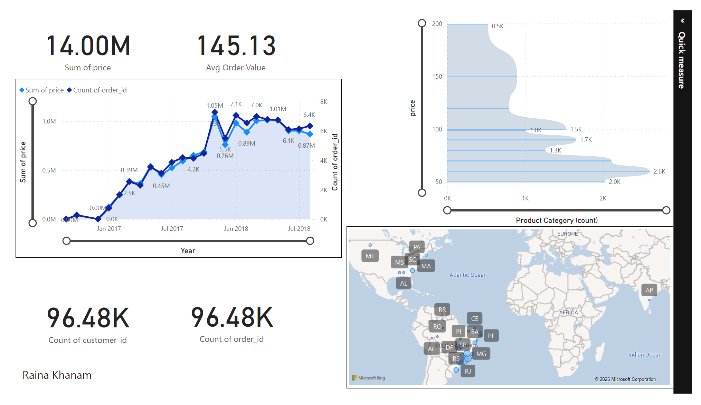
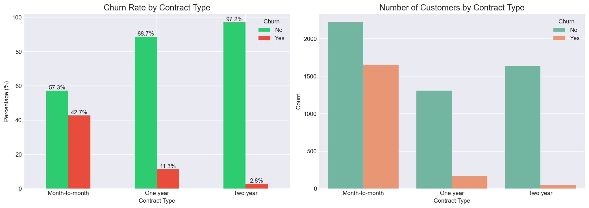
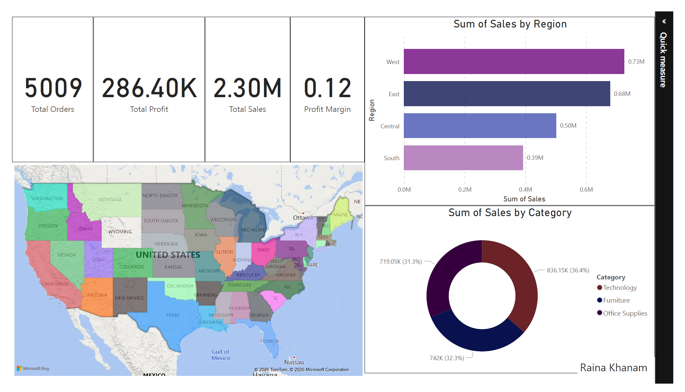

# 👋 Hi, I'm Raina

**Data Analyst | SQL | Python | Tableau | Power BI**

Welcome to my data analytics portfolio! I'm passionate about turning raw data into actionable insights. With expertise in SQL, Python, and BI tools, I deliver data-driven solutions that help businesses make better decisions.

---

## 📁 Featured Projects

### 1. 🛍️ [Brazilian E-Commerce Analytics](project-3-ecommerce-analysis/)

**End-to-end analysis of 100,000+ orders**

- **Tools:** SQL, Python, Power BI, DAX
- **Impact:** Identified $16M+ revenue trends, customer segments, and delivery time impact on satisfaction
- **Key Finding:** 0-5 day delivery = 4.5⭐ | 15+ day delivery = 3.2⭐

---

### 2. 📞 [Customer Churn Analysis](project-2-customer-churn/)

**Predicting and reducing customer attrition**

- **Tools:** Python, Pandas, Matplotlib, AI Dashboards
- **Impact:** Identified contract type and tenure as the strongest churn predictors
- **Key Finding:** Month-to-month customers are 8x more likely to churn than 2-year contract customers

---

### 3. 🏪 [Superstore Sales Analysis](project-1-superstore-sales/)

**Sales performance and product profitability**

- **Tools:** SQL, Power BI, DAX
- **Impact:** Identified top/bottom performing products and regional trends
- **Key Finding:** Technology category has highest profit margin at 22%

---

## 🛠️ Skills

| Category      | Technologies                                     |
| ------------- | ------------------------------------------------ |
| **Languages** | SQL, Python (Pandas, NumPy, Matplotlib, Seaborn) |
| **BI Tools**  | Power BI, Tableau, Excel                         |
| **Databases** | MySQL, PostgreSQL, SQL Server                    |
| **AI Tools**  | Julius AI, ChatGPT, Sparkco                      |
| **Other**     | Git, GitHub, Jupyter Notebook                    |

---

## 📊 My Approach

1. **Understand the business problem** — What question needs answering?
2. **Extract & clean data** — SQL queries, Python data cleaning
3. **Analyze & visualize** — Statistical analysis, dashboards
4. **Communicate insights** — Clear recommendations for stakeholders

---

## 📫 Let's Connect

- **GitHub:** (https://github.com/raina989)
- \*_LinkedIn:_ (www.linkedin.com/in/raina-khanam)
- **Email:** khanraina12@gmail.com

---

_Currently open to remote Data Analyst roles worldwide._
