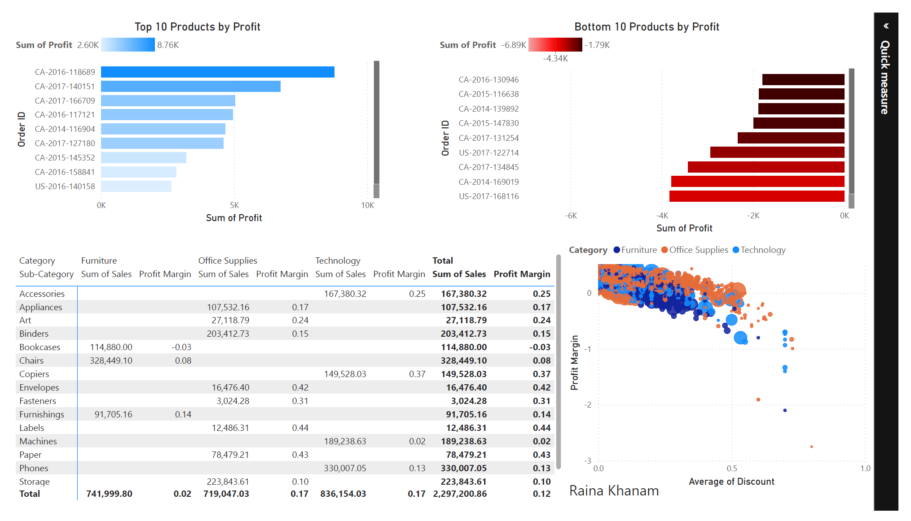
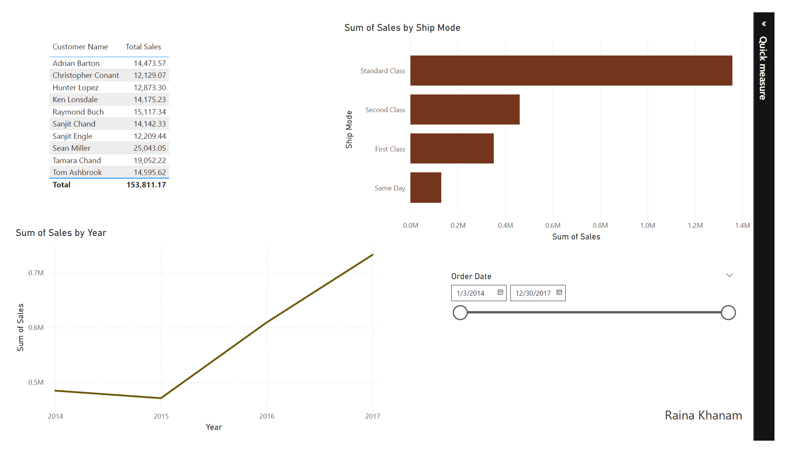

# 🛒 Superstore Sales Analysis

## 📌 Project Overview

This project analyzes sales data from a superstore to uncover key business insights. The analysis includes SQL queries for data extraction and an interactive Power BI dashboard for visualization.

## 🎯 Business Questions Answered

- Which regions and states generate the highest sales?
- What are the top 10 most profitable products?
- Which products are losing money?
- How do discounts impact profitability?
- What are the monthly sales trends?
- Who are the top customers?

## 🛠️ Tools Used

| Tool     | Purpose                              |
| -------- | ------------------------------------ |
| SQL      | Data extraction and analysis         |
| Power BI | Dashboard creation and visualization |
| DAX      | Calculated measures and KPIs         |

## 📊 Key Insights

1. **West region** generates the highest sales, contributing 32% of total revenue
2. **Technology category** has the highest profit margin at 22%
3. **Discounts above 30%** significantly reduce profit margins
4. **December** shows the highest sales spike (holiday season)
5. Top 10 customers account for 8% of total revenue

## 📁 Files

| File                        | Description                       |
| --------------------------- | --------------------------------- |
| `queries.sql`               | All SQL queries used for analysis |
| `superstore_dashboard.pbix` | Power BI dashboard file           |
| `screenshots/`              | Dashboard page screenshots        |

## 🖥️ Dashboard Preview

### Executive Overview


### Product Analysis



### Time & Customer Analysis



## 📈 Sample SQL Query

```sql
-- Top 10 products by profit
SELECT
    product_name,
    ROUND(SUM(sales), 2) AS total_sales,
    ROUND(SUM(profit), 2) AS total_profit
FROM superstore
GROUP BY product_name
ORDER BY total_profit DESC
LIMIT 10;

🚀 How to Use
Download superstore_dashboard.pbix

Open in Power BI Desktop

Use slicers to filter by region, category, or date

📫 Connect with Me
GitHub: https://github.com/raina989

LinkedIn: www.linkedin.com/in/raina-khanam

Email: khanraina12@gmail.com

Project completed as part of Data Analytics Portfolio

```
