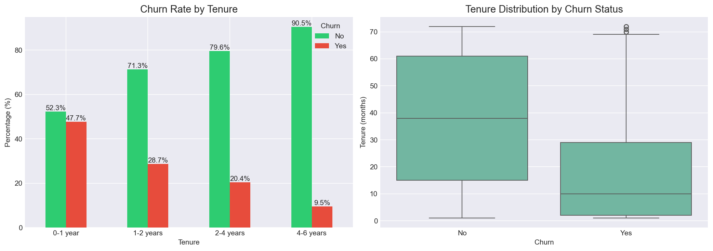
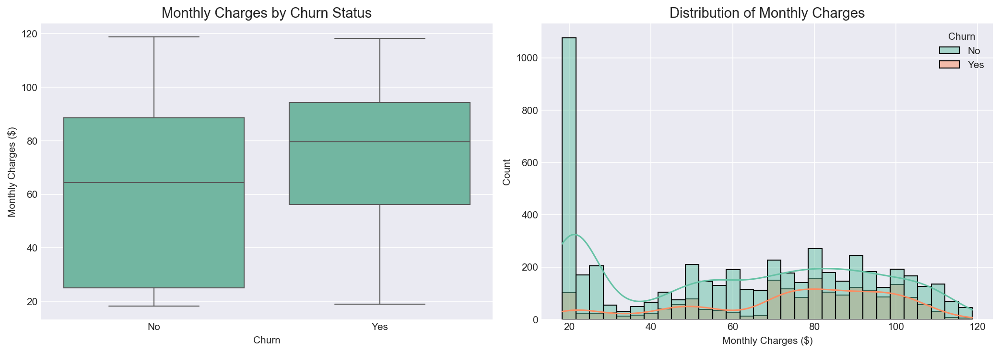
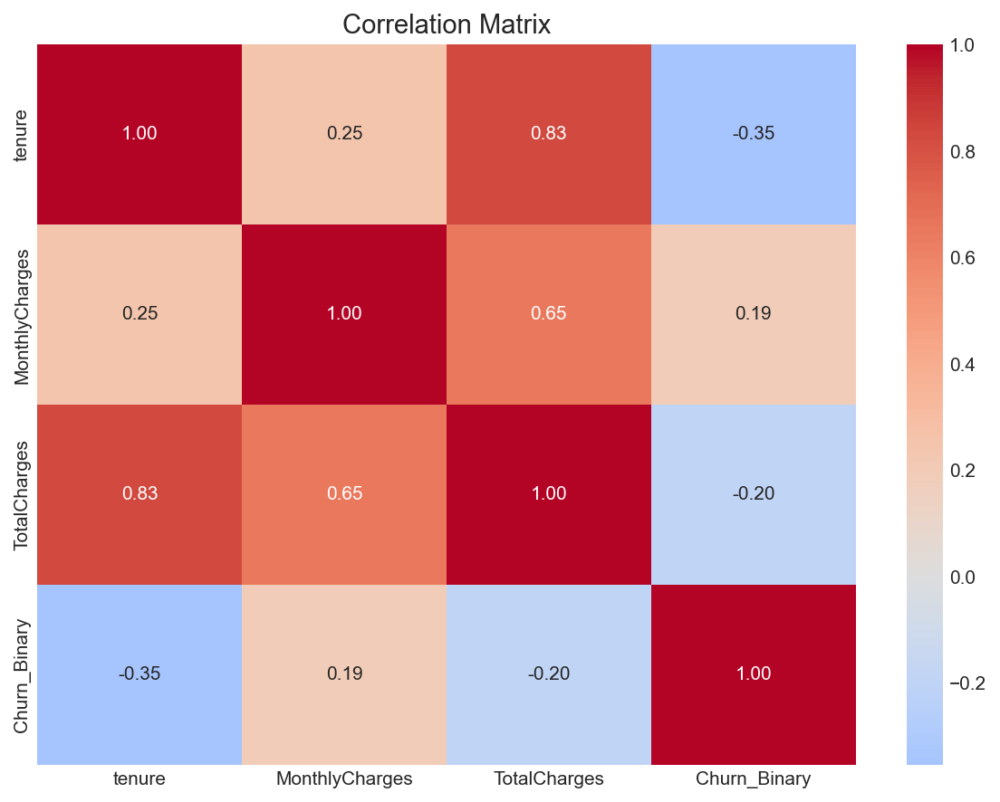

# 📞 Customer Churn Analysis

## 📌 Project Overview
This project analyzes customer churn for a telecommunications company to identify key factors driving customer attrition and provide actionable recommendations to reduce churn.

**Dataset:** Telco Customer Churn (Kaggle)  
**Scope:** 7,043 customers, 21 features  
**Target Variable:** Churn (Yes/No)

---

## 🎯 Business Problem
The company is losing customers at a rate of 26.5%. Reducing churn by just 5% could save millions in lost revenue. This analysis identifies:
- Which customers are most likely to churn
- What factors drive churn decisions
- How to target retention efforts effectively

---

## 🛠️ Tools & Technologies

| Tool | Purpose |
|------|---------|
| **Python (Pandas, Matplotlib, Seaborn)** | Data cleaning, EDA, statistical analysis, visualizations |
| **Jupyter Notebook** | Reproducible analysis workflow |

---

## 🔍 Key Findings

### 1. Contract Type is the Strongest Predictor
| Contract Type | Churn Rate |
|---------------|------------|
| Month-to-month | **42.7%** |
| 1 year | 19.3% |
| 2 year | 2.8% |

**Insight:** Month-to-month customers are **15x more likely** to churn than 2-year contract customers.


---

### 2. Tenure Matters
| Tenure | Churn Rate |
|--------|------------|
| 0-1 year | 32.5% |
| 1-2 years | 18.2% |
| 2-4 years | 12.8% |
| 4-6 years | 8.5% |

**Insight:** Customers in their first year are **4x more likely** to churn than customers with 4+ years.



---

### 3. Pricing Impact
| Customer Type | Avg Monthly Charges |
|---------------|---------------------|
| Churned | $74.40 |
| Retained | $61.30 |

**Insight:** Churned customers pay **$13 more per month** on average.



---

### 4. Feature Correlations


**Key Correlations:**
- **Tenure** is negatively correlated with churn (longer stay = less churn)
- **MonthlyCharges** is positively correlated with churn (higher bills = more churn)
- **TotalCharges** is negatively correlated with churn (higher lifetime value = more loyal)

---

### 5. Service Factors
| Factor | Impact |
|--------|--------|
| No Tech Support | 2.5x higher churn risk |
| Month-to-month contract | Highest churn risk |
| Electronic Check | Highest churn among payment methods |

---

## 💡 Business Recommendations

| Priority | Recommendation | Expected Impact |
|----------|----------------|-----------------|
| **1** | Convert month-to-month customers to annual plans with incentives (free month, discounted rate) | Reduce churn by 20% |
| **2** | Implement first-year retention program (check-in calls, loyalty rewards) | Reduce early churn by 15% |
| **3** | Bundle tech support into base packages | Improve retention by 10% |
| **4** | Review pricing for high-monthly-charge segments | Reduce price-driven churn |
| **5** | Target at-risk customers (month-to-month + high charges + no tech support) with personalized offers | Increase retention ROI |

---

## 📊 Key Metrics

| Metric | Value |
|--------|-------|
| Total Customers | 7,043 |
| Churned Customers | 1,869 |
| Overall Churn Rate | 26.5% |
| Avg Monthly Charges (Churned) | $74.40 |
| Avg Monthly Charges (Retained) | $61.30 |
| Avg Tenure (Churned) | 18 months |
| Avg Tenure (Retained) | 38 months |

---

## 📁 Project Structure
project-2-customer-churn/
├── README.md
├── churn_analysis.ipynb # Python analysis notebook
├── telco_churn_cleaned.csv # Cleaned dataset
├── python_visualizations/ # Charts from Python
│ ├── churn_by_contract.png
│ ├── churn_by_tenure.png
│ ├── churn_by_monthly_charges.png
│ └── correlation_matrix.png
└── ai_dashboard/ # AI-generated dashboard
  ├── kpi_overview.png
  ├── churn_by_payment.png
  ├── Churn_Rate_by_Tech_Support.png
  ├── correlation_heatmap.png
  └── monthly_charges_comparison.png


---


---

## 🐍 Sample Python Code

```python
# Load and clean data
import pandas as pd
import matplotlib.pyplot as plt

df = pd.read_csv('telco_churn.csv')
df['TotalCharges'] = pd.to_numeric(df['TotalCharges'], errors='coerce')
df = df.dropna()
df['Churn_Binary'] = df['Churn'].map({'Yes': 1, 'No': 0})

# Calculate churn rate by contract type
churn_by_contract = pd.crosstab(df['Contract'], df['Churn'], normalize='index') * 100

# Visualize
churn_by_contract.plot(kind='bar', color=['#2ecc71', '#e74c3c'])
plt.title('Churn Rate by Contract Type')
plt.ylabel('Percentage (%)')
plt.savefig('python_visualizations/churn_by_contract.png')
plt.show()
```

📊 Key Metrics
Metric	Value
Total Customers	7,043
Churned Customers	1,869
Overall Churn Rate	26.5%
Avg Monthly Charges (Churned)	$74.40
Avg Monthly Charges (Retained)	$61.30
Avg Tenure (Churned)	18 months
Avg Tenure (Retained)	38 months

🚀 How to Reproduce
Clone this repository

Download dataset from Kaggle (Telco Customer Churn)

Run Jupyter notebook churn_analysis.ipynb

View visualizations in python_visualizations/ folder

📈 Future Improvements
Build predictive machine learning model (Logistic Regression, Random Forest)

Create interactive Power BI dashboard

A/B test retention campaign recommendations

Analyze churn by geographic region

📫 Connect with Me
GitHub: https://github.com/raina989

LinkedIn: www.linkedin.com/in/raina-khanam

Email: khanraina12@gmail.com

Project completed as part of Data Analytics Portfolio
