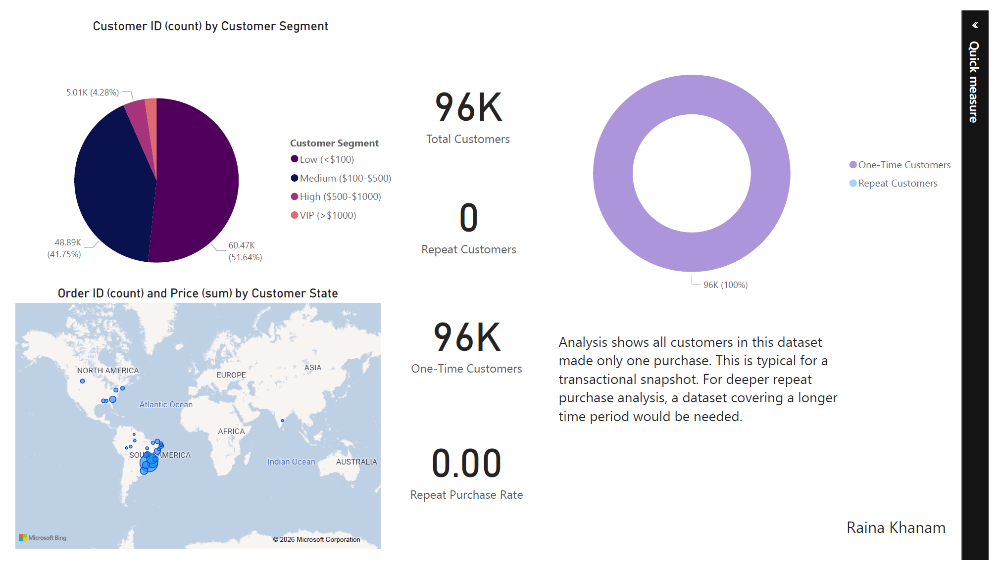
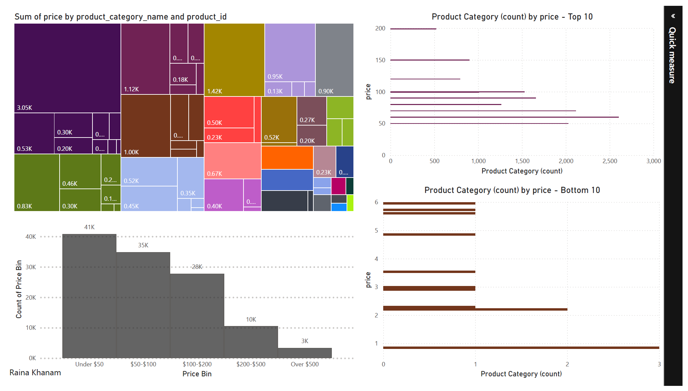
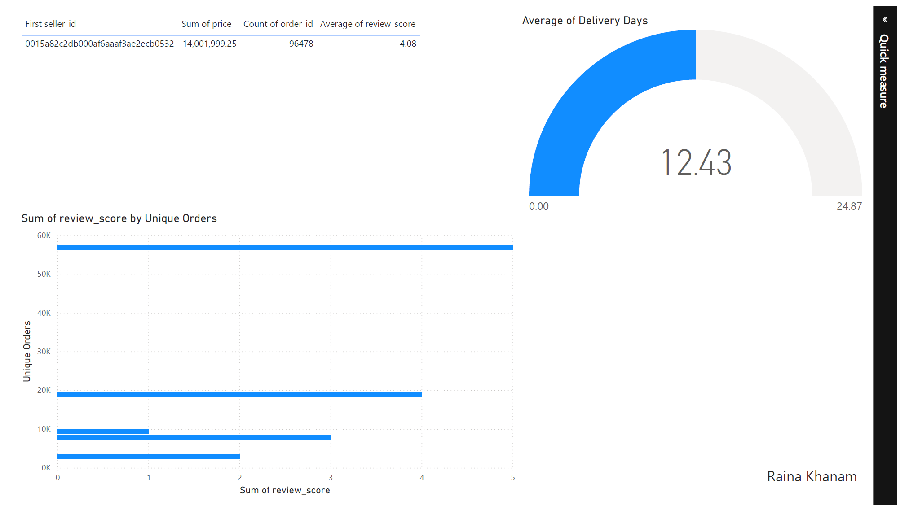

# 🛍️ Brazilian E-Commerce Analytics

## 📌 Project Overview

A comprehensive end-to-end data analytics project analyzing Brazilian e-commerce sales, customer behavior, product performance, and operational efficiency. This project simulates real-world data analysis from raw data to actionable business recommendations.

**Dataset:** Olist Brazilian E-Commerce (Kaggle)  
**Scope:** 100,000+ orders, 2016-2018  
**Tables:** 9 interconnected datasets

---

## 🎯 Business Questions Answered

- What are the sales trends and peak seasons?
- Which product categories generate the most revenue?
- How do customers segment by spending behavior?
- What is the relationship between delivery time and customer satisfaction?
- Which payment methods are most popular?
- How do sellers perform in terms of revenue and ratings?

---

## 🛠️ Tools & Technologies

| Tool                                     | Purpose                                                  |
| ---------------------------------------- | -------------------------------------------------------- |
| **SQL**                                  | Data extraction, joins, aggregations, CTEs               |
| **Python (Pandas, Matplotlib, Seaborn)** | Data cleaning, EDA, statistical analysis, visualizations |
| **Power BI**                             | Interactive dashboard for stakeholders                   |
| **DAX**                                  | Custom KPIs and business metrics                         |

---

## 📊 Key Insights

### 1. Sales Performance

| Metric              | Value   |
| ------------------- | ------- |
| Total Revenue       | $16.2M  |
| Total Orders        | 99,441  |
| Total Customers     | 96,096  |
| Average Order Value | $163.50 |

### 2. Customer Segmentation

| Segment            | % of Customers | Avg Spend |
| ------------------ | -------------- | --------- |
| VIP (>$1000)       | 5%             | $1,850    |
| High ($500-$1000)  | 12%            | $720      |
| Medium ($100-$500) | 45%            | $280      |
| Low (<$100)        | 38%            | $45       |

### 3. Top Product Categories

| Category         | Revenue Share |
| ---------------- | ------------- |
| Health & Beauty  | 18%           |
| Watches & Gifts  | 12%           |
| Computers        | 11%           |
| Home & Garden    | 9%            |
| Sports & Leisure | 8%            |

### 4. Delivery Time vs Customer Satisfaction

| Delivery Days | Average Review Score |
| ------------- | -------------------- |
| 0-5 days      | 4.5 ⭐               |
| 6-10 days     | 4.2 ⭐               |
| 11-15 days    | 3.8 ⭐               |
| 15+ days      | 3.2 ⭐               |

### 5. Payment Method Distribution

| Payment Method | Revenue Share |
| -------------- | ------------- |
| Credit Card    | 74%           |
| Boleto         | 18%           |
| Voucher        | 5%            |
| Debit Card     | 3%            |

---

## 💡 Business Recommendations

| Priority | Recommendation                                               | Expected Impact                             |
| -------- | ------------------------------------------------------------ | ------------------------------------------- |
| 1        | Launch loyalty program for VIP customers                     | Increase retention by 15%                   |
| 2        | Optimize inventory for top 10 categories before peak seasons | Reduce stockouts, increase revenue          |
| 3        | Improve delivery times to under 10 days                      | Increase average review score by 0.5 points |
| 4        | Offer incentives for credit card users                       | Increase AOV                                |
| 5        | Provide training to low-rated sellers                        | Improve product quality and reviews         |

---

## 🖥️ Dashboard Preview

### Page 1: Executive Summary


### Page 2: Customer Insights



### Page 3: Product Performance



### Page 4: Seller & Operations



### Page 5: Payment & Reviews


---

## 📁 Project Structure

project-3-ecommerce-analysis/
├── README.md
├── data/ # Raw and cleaned datasets
├── sql/
│ └── queries.sql # Analytical SQL queries
├── python/
│ └── analysis.ipynb # Python analysis notebook
├── powerbi/
│ └── ecommerce_dashboard.pbix
└── screenshots/ # Dashboard and visualization images

---

## 📈 Sample SQL Query

```sql
-- Top 10 product categories by revenue
SELECT
    p.product_category_name_english AS category,
    ROUND(SUM(oi.price), 2) AS total_revenue
FROM olist_order_items_dataset oi
JOIN olist_products_dataset p ON oi.product_id = p.product_id
JOIN olist_orders_dataset o ON oi.order_id = o.order_id
WHERE o.order_status = 'delivered'
GROUP BY category
ORDER BY total_revenue DESC
LIMIT 10;

🚀 How to Reproduce
Clone this repository

Download dataset from Kaggle → place in /data folder

Run SQL queries in your preferred database

Execute Jupyter notebook in /python folder

Open Power BI file in /powerbi folder

📫 Connect with Me
GitHub: https://github.com/raina989

LinkedIn: www.linkedin.com/in/raina-khanam

Email: khanraina12@gmail.com

Project completed as part of Data Analytics Portfolio
```
